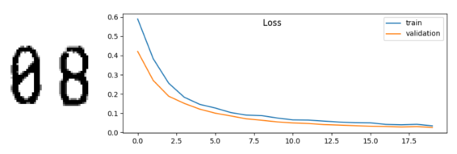
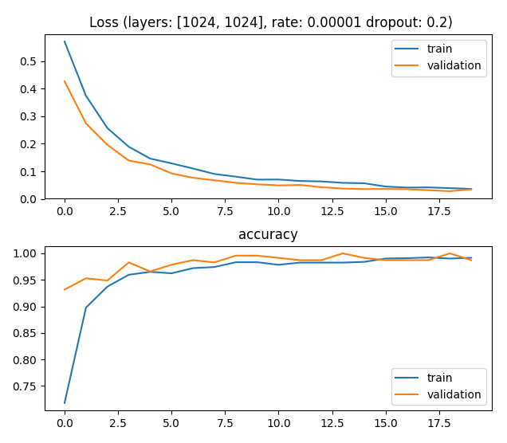
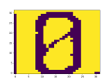
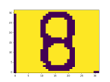
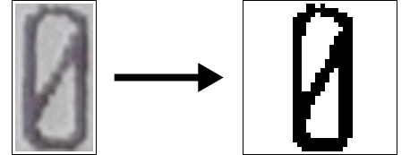
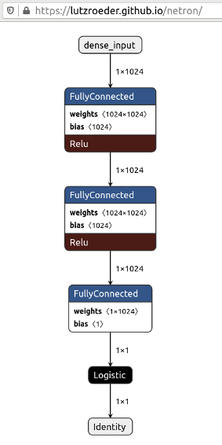
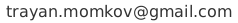

# ZEC - Slashed Zero-Eight Classifier




Slashed **Z**ero-**E**ight **C**lassifier (**ZEC**) is a simple binary
classifier, distinguishing slashed zeroes from eights.

For the pre-trained tflite model that can be used in Android, see [**ZECA
 for Android**](https://github.com/trayanmomkov/zeca).

## Motivation
I'm using Google ML Kit for Firebase in my
[ReCalc: Receipt Calculator](https://play.google.com/store/apps/details?id=info.trekto.receipts)
app but its accuracy
 on slashed zeroes is around 70%. I decided to train a model myself.
  
## Prerequisites
- Python + pip (You should be able use Python 2 but I recommend
 Python 3.7)
- Up to 5GiB temporary free disk space for TensorFlow installation
- Basic machine learning knowledge

## Installation
To install dependencies:
```
$ pip install numpy
$ pip install image
$ pip install matplotlib
$ pip install tensorflow
```

## Usage
To train and predict:
```
cd zec/
python main.py
```
If you want to train on your own collection of images, before `main.py
` you have to execute:
```
cd zec/
python preprocess.py
```
If you get `No module named PIL` error try to replace
`from PIL import Image` with `import Image`.

See the **Preprocessing** section below.

## Description
The project contains a dataset of **1854 images** of slashed zeroes and eights
which were used to train a **TensorFlow** model in Python. All of them
 are extracted from receipts.

Achieved result is pretty good (above **98% accuracy**) but I'm
 concerned about
 overfitting because of the small dataset. I'm not sure how well
  the
  model generalize.

The model has never been tested on **non slashed** zeroes and probably acts
very poorly on them.


Inside the main() function you will find a map with **hyper parameters** which
 you can tweak:
```
hyper_parameters = {'layers': [1024, 1024], 'rate': 0.00001, 'drop': 0.2, 'epochs': 20, 'batch': 10}
```
Where:
 - `[1024, 1024]` represents a **neural network** with two layers with 1024
 neurons each.
 - `'rate': 0.00001` is the learning rate - how fast the model learns.
 - `'drop': 0.2` is the [**dropout**](https://en.wikipedia.org/wiki/Dropout_(neural_networks)) (20% of the neurons are dropped to
 prevent overfitting).
 - `'epochs': 20` shows how many times we will iterate over the entire
  dataset.
 - `'batch': 10` _["number of samples to work through before updating the
  internal model parameters"](https://machinelearningmastery.com/difference-between-a-batch-and-an-epoch/)_.

When the training finishes you will see the following graphics:


And after that a test images with predicted digit and confidence in the
 console:
 ```
Prediction: 0 Confidence: 0.9
Prediction: 8 Confidence: 1.0
...
 ```
 
 

For every run of `main.py` it saves the model as
**[SavedModel](https://www.tensorflow.org/guide/saved_model)**
in `saved_models/<date>_<time>/`
and **TensorFlow Lite model** (tflite) in
`tflite_models/<date>_<time>.tflite`.

### Dataset
Most of the images are extracted from **receipts** printed in Bulgaria
 between August 2019 and February 2020. I've collected them from
  restaurants, cafes, shops, fuel stations etc. I hope they represent
   a big part of the most used fonts worldwide.
   
The average number of eights in a receipt is significantly smaller than
  that of zeroes. Thus for the eights, I've used more than
   one receipts from the same location. For the zeroes I've used only
    receipts from different locations. This way I deal with otherwise
     imbalanced dataset.
    Techniques like [SMOTE](https://machinelearningmastery.com/smote-oversampling-for-imbalanced-classification/) are not used.

I tried to shoot the receipts in environment as close as possible to the
 environment in restaurants and cafes where you try to split your
  common bill with friends.
 As I already mentioned my final goal was to predict numbers in my
  bill splitting application - **ReCalc**.
  
  Pictures are taken with
 **Samsung Galaxy A8+** and **Huawei Honor 4X** in
 proportion 70/30. The proportion regarding the light is about:
 - 26% night, low light
 - 16% night, bright light
 - 26% night with flash
 - 26% day, diffuse light 
 - 6% day, bright sun
 
 Original images are in `dataset/original/`.
 
 The file name pattern is:
 `<digit>_<timestamp>_<unique number in the receipt>.png`
 where:
- `<digit>` shows whether 0 or 8 is on the photo
- `<timestamp>` format is `yyyy-MMM-dd_HH-mm-ss-SSS` 
 
 Images are in **png** format because it supports lossless compression
  compared to **jpeg** which is always lossy.


### Preprocessing



The following manipulations are applied to the original images before
 training:
- converting to **monochrome** image
- **scaling** so width and height are no more than 32 pixels
- converting to **black and white** image
- adding white **frame** (for images with width or height less than 32
 pixels)
- **centering** image horizontally by pixel weight and vertically by
 bounding box
 (frame)
 
 I've tried different variants but empirically these above produce
  the best result.
  
 I was thinking if the image is **monochrome** the model will be able to
   fit it better. And maybe this is true. The problem is that this way it
    looks like it starts overfitting. And I suspect this is because the
     monochrome image contains more information, or in other words
      - more noise. 
    

If you run `python preprocess.py` it:
- reads the files in `dataset/original/`
- splits them into `training` and `test` parts
- asks you whether you like the number of zeroes and eights in each part
- transforms them and finally produces the following:
    - `dataset/proprocessed/training` - preprocessed training images
    - `dataset/proprocessed/test` - preprocessed test images
    - `dataset/training.csv` - file used by `main.py` for training
    - `dataset/test.csv` - file used by `main.py` for test
    
In `training` and `test` directories you can see how prepared for
 training images look. On the final step `preprocess.py` uses them to
 generate the `csv` files.
 
 On every line in each of the two `csv` files,
 a single digit is encoded. The first number is the label: **0** or **8**,
 followed by **1024** numbers. These numbers represent the values of the
 pixels of **32x32** black and white bitmap image. Because the image is
  black and white the numbers can only be **0** or **255**.
  
Here is an example of two digits, 8 and 0:
```
8,255,255,255,255,255,0,255,0,255,0,0,255,0,0,0,255,255...
0,255,255,255,0,255,0,255,255,255,0,255,0,255,0,0,255,255...
```

## Model and Training
I'm using a sequential model with just two layers. You can change this
 in hyper parameters map. The idea is to use the
 **simplest** model that **solves the problem**. The simple model is less
  likely to overfit.
  
- Activation between the layers is `relu`
and for the final layer - `sigmoid`.
- Loss: `binary_crossentropy`
- Metrics: `accuracy`
- Dropout: `0.2`
- Optimizer: [Adam](https://arxiv.org/abs/1412.6980)


  


## Contributing to ZEC
 If you can improve **how well the model generalize** (or something else),
  without sacrificing the simplicity of the code you are welcome to
   contribute.
  
To do that, follow these steps:

1. Fork this repository.
2. Create a branch: `git checkout -b <branch_name>`.
3. Make your changes and commit them: `git commit -m '<commit_message>'`
4. Push to the original branch: `git push origin <project_name>/<location>`
5. Create the pull request.

Alternatively see the GitHub documentation on [creating a pull request](https://help.github.com/en/github/collaborating-with-issues-and-pull-requests/creating-a-pull-request).

## Contact
If you find an error, something looks incorrect or just have a suggestion please write me.



Trayan Momkov

## License
[Apache License 2.0](LICENSE)